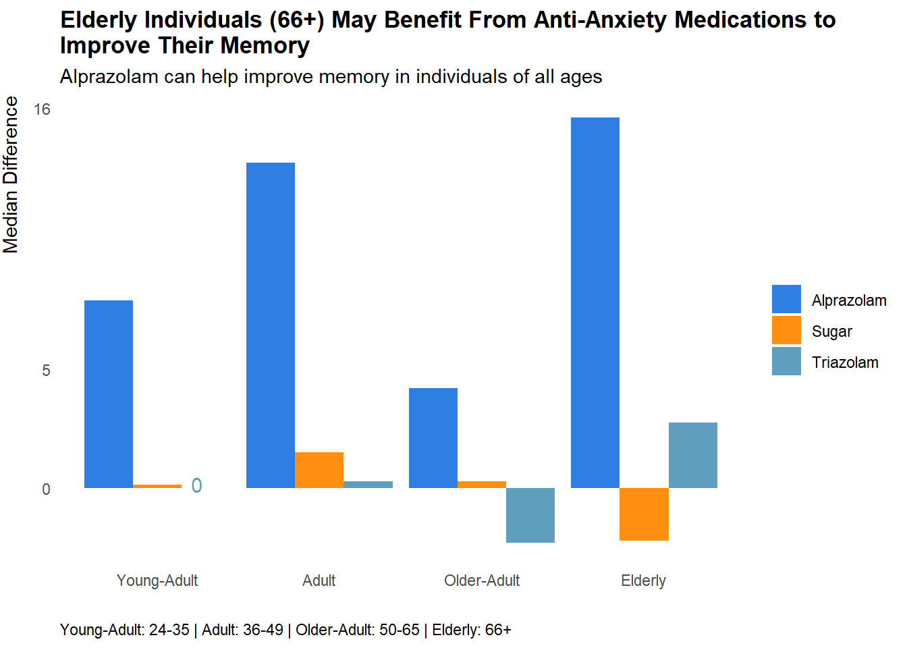
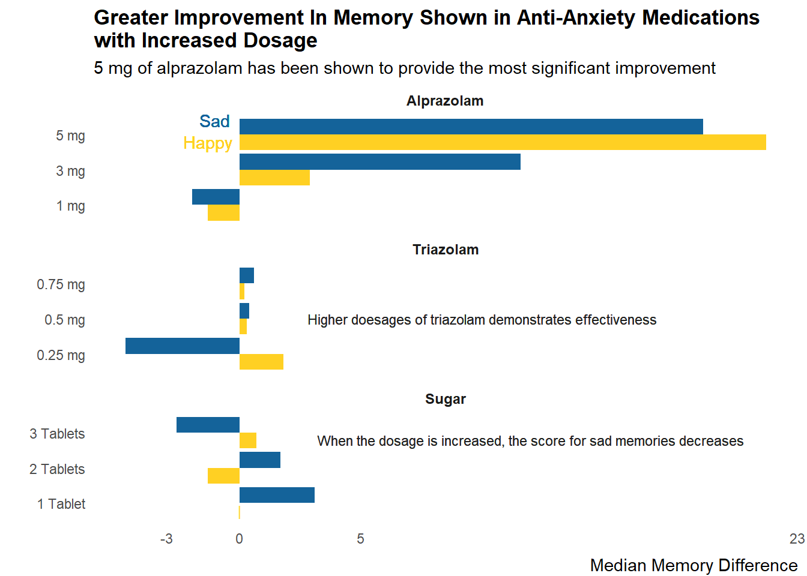
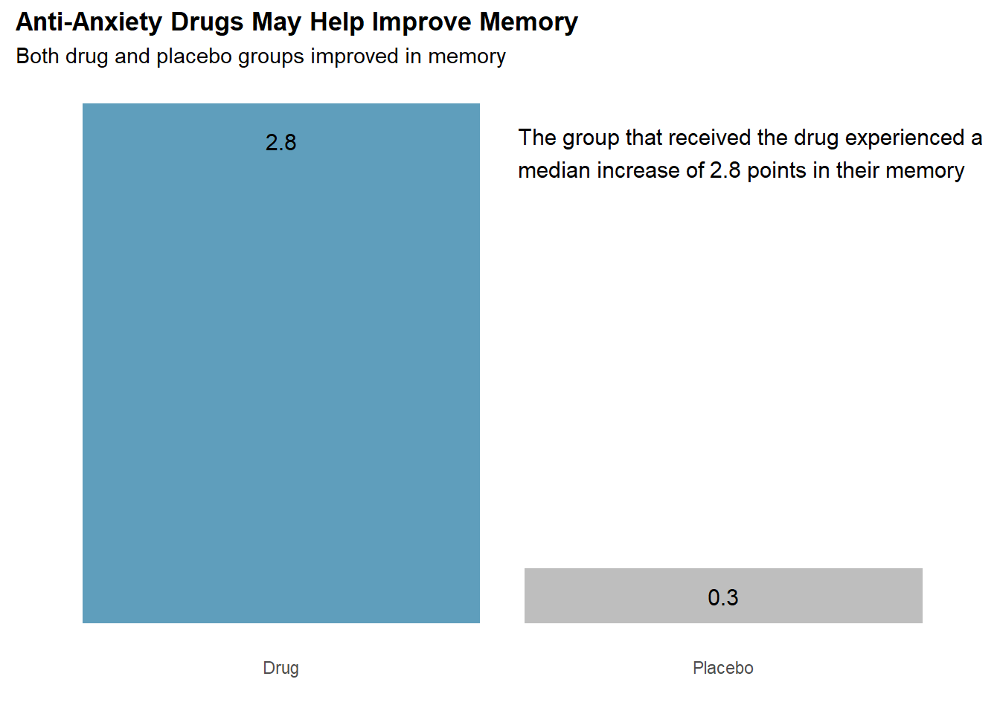
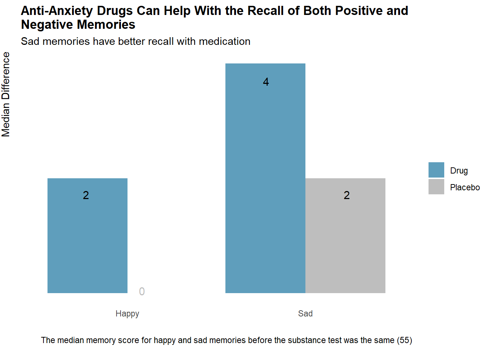
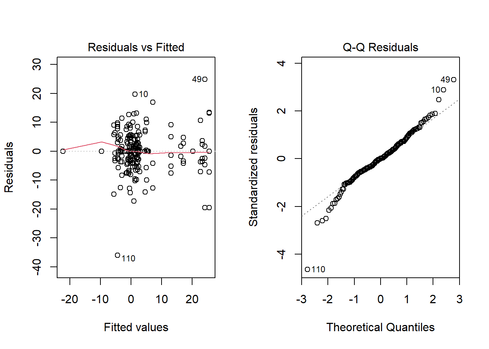

::: {.cell}

```{.r .cell-code}
library(rmarkdown)
library(tidyverse)
library(formattable)
```
:::

::: {.cell}

```{.r .cell-code}
df <- read_csv('C:\\Users\\derek\\OneDrive\\Documents\\DerekDoelling.github.io\\Islander_data.csv')
```
:::

::: {.cell}

```{.r .cell-code}
df <- df %>%
  mutate(
    Drug = case_when(
      Drug == "A" ~ "Alprazolam",
      Drug == "T" ~ "Triazolam",
      Drug == "S" ~ "Sugar",
      TRUE ~ as.character(Drug)
    ),
    mode = case_when(
      Drug != 'Sugar' ~ 'Drug',
      Drug == 'Sugar' ~ 'Placebo'
    ),
    Happy_Sad_group = case_when(
      Happy_Sad_group == "H" ~ "Happy",
      Happy_Sad_group == "S" ~ "Sad",
      TRUE ~ as.character(Happy_Sad_group)
    ), 
    age = case_when(
      age >= 24 & age <= 35 ~ 'Young-Adult', 
      age >= 36 & age <= 49 ~ 'Adult', 
      age >= 50 & age <= 65 ~ 'Older-Adult', 
      age >= 66 ~ 'Elderly', 
      TRUE ~ as.character(age)
    ), 
    Dosage = case_when(
      Drug == 'Alprazolam' & Dosage == 1 ~ '1 mg',
      Drug == 'Alprazolam' & Dosage == 2 ~ '3 mg',
      Drug == 'Alprazolam' & Dosage == 3 ~ '5 mg',
      Drug == 'Triazolam' & Dosage == 1 ~ '0.25 mg', 
      Drug == 'Triazolam' & Dosage == 2 ~ '0.5 mg',
      Drug == 'Triazolam' & Dosage == 3 ~ '0.75 mg', 
      Drug == 'Sugar' & Dosage == 1 ~ '1 Tablet', 
      Drug == 'Sugar' & Dosage == 2 ~ '2 Tablets',
      Drug == 'Sugar' & Dosage == 3 ~ '3 Tablets',
      TRUE ~ as.character(Dosage)
    )
  ) %>%
  mutate(
    Drug = as_factor(Drug),
    Happy_Sad_group = as_factor(Happy_Sad_group),
    age = as_factor(age)
  )
```
:::

::: {.cell}

```{.r .cell-code}
medvsplac <- df %>% 
  group_by(mode) %>% 
  summarize(
    median_diff = round(median(Diff), 1)
  )
```
:::

::: {.cell}

```{.r .cell-code}
medvplac <- df %>% 
  group_by(Drug, Dosage, Happy_Sad_group, mode) %>% 
  summarize(
    avg_mem_diff = round(mean(Diff, na.rm = TRUE), 2),
    median_diff = round(median(Diff, na.rm = TRUE), 2), 
    .groups = "drop_last" 
  ) %>% 
  mutate(
    Drug = as_factor(Drug), 
    Drug = fct_relevel(Drug, 'Alprazolam', 'Triazolam', 'Sugar'), 
    mode = factor(mode, levels = c("Drug", "Placebo")),
    mode = fct_relevel(mode, 'Drug', 'Placebo')
  ) %>% 
  arrange(factor(mode, levels = c("Drug", "Placebo")), Drug, Dosage, Happy_Sad_group) %>% 
  rename(Group = Happy_Sad_group, Class = mode, `Average Memory Difference` = avg_mem_diff, 'Median Memory Difference' = median_diff)
```
:::

::: {.cell}

```{.r .cell-code}
druggroup <- df %>% 
  group_by(Drug, Dosage, Happy_Sad_group) %>% 
  summarize(
    median_mem_diff = round(median(Diff), 2)
  ) %>% 
  mutate(Drug = fct_relevel(Drug, 'Alprazolam', 'Triazolam', 'Sugar')) %>% 
  arrange(Drug, Dosage, Happy_Sad_group)

druggroup <- druggroup %>%
  mutate(Dosage = factor(Dosage, levels = c("1 mg", "3 mg", "5 mg", "0.25 mg", "0.5 mg", "0.75 mg", "1 Tablet", "2 Tablets", "3 Tablets")), 
         Happy_Sad_group = factor(Happy_Sad_group, levels = c('Happy', 'Sad')))
```
:::

::: {.cell}

```{.r .cell-code}
age_group <- df %>% 
  group_by(age, Drug) %>% 
  summarize(median_diff = round(median(Diff), 2)) %>% 
  arrange(factor(age, levels = c("Young-Adult", "Adult", "Older-Adult", "Elderly")))

age_group$age <- factor(age_group$age, levels = c("Young-Adult", "Adult", "Older-Adult", "Elderly"))
```
:::

::: {.cell}

```{.r .cell-code}
emotion <- df %>% 
  group_by(Happy_Sad_group, mode) %>% 
  summarize(
    median_diff = round(median(Diff)))

emotions <- df %>% 
  group_by(Happy_Sad_group) %>% 
  summarize(
    median_b = round(median(Mem_Score_Before)), 
    median_diff = round(median(Diff)))
```
:::

::: {.cell}

```{.r .cell-code}
outliers <- df %>% 
  pivot_longer(cols = starts_with("Mem_Score"), names_to = "Memory", values_to = "Score")

avg <- outliers %>% 
  group_by(Memory) %>% 
  summarize(
    mean = mean(Score), 
    median = median(Score))
```
:::


# Introduction

I have had a long-standing interest in pharmaceuticals. I recently came across a dataset on Kaggle that examined the effects of anti-anxiety medication on memory recall. The experiment involved participants who were primed with happy or sad memories, and I found it intriguing. I decided to address the questions that inspired the study and plan to present my findings with the corresponding questions stated in the Kaggle dataset information as headings. To avoid issues with outliers, I will be using the median instead of the mean for comparisons.

The dataset can be found [here](https://www.kaggle.com/datasets/steveahn/memory-test-on-drugged-islanders-data). The experiment was executed under the supervision of Mr. Almohalwas at UCLA.

### Table Covering General Analysis


::: {.cell}

```{.r .cell-code}
formattable(medvplac, list(
  `Average Memory Difference` = formatter("span",
    style = x ~ formattable::style(
      display = "block",
      padding = "0 4px",
      `border-radius` = "4px",
      `background-color` = ifelse(x > 0, "#4dcd33", "#ea4e4e")
    )
  ),
  `Median Memory Difference` = formatter("span",
    style = x ~ formattable::style(
      display = "block",
      padding = "0 4px",
      `border-radius` = "4px",
      `background-color` = ifelse(x > 0, "#4dcd33", "#ea4e4e")
    )
  )
))
```

::: {.cell-output-display}

<table class="table table-condensed">
 <thead>
  <tr>
   <th style="text-align:right;"> Drug </th>
   <th style="text-align:right;"> Dosage </th>
   <th style="text-align:right;"> Group </th>
   <th style="text-align:right;"> Class </th>
   <th style="text-align:right;"> Average Memory Difference </th>
   <th style="text-align:right;"> Median Memory Difference </th>
  </tr>
 </thead>
<tbody>
  <tr>
   <td style="text-align:right;"> Alprazolam </td>
   <td style="text-align:right;"> 1 mg </td>
   <td style="text-align:right;"> Happy </td>
   <td style="text-align:right;"> Drug </td>
   <td style="text-align:right;"> <span style="display: block; padding: 0 4px; border-radius: 4px; background-color: #ea4e4e">-0.61</span> </td>
   <td style="text-align:right;"> <span style="display: block; padding: 0 4px; border-radius: 4px; background-color: #ea4e4e">-1.30</span> </td>
  </tr>
  <tr>
   <td style="text-align:right;"> Alprazolam </td>
   <td style="text-align:right;"> 1 mg </td>
   <td style="text-align:right;"> Sad </td>
   <td style="text-align:right;"> Drug </td>
   <td style="text-align:right;"> <span style="display: block; padding: 0 4px; border-radius: 4px; background-color: #4dcd33">1.14</span> </td>
   <td style="text-align:right;"> <span style="display: block; padding: 0 4px; border-radius: 4px; background-color: #ea4e4e">-1.95</span> </td>
  </tr>
  <tr>
   <td style="text-align:right;"> Alprazolam </td>
   <td style="text-align:right;"> 3 mg </td>
   <td style="text-align:right;"> Happy </td>
   <td style="text-align:right;"> Drug </td>
   <td style="text-align:right;"> <span style="display: block; padding: 0 4px; border-radius: 4px; background-color: #4dcd33">2.12</span> </td>
   <td style="text-align:right;"> <span style="display: block; padding: 0 4px; border-radius: 4px; background-color: #4dcd33">2.90</span> </td>
  </tr>
  <tr>
   <td style="text-align:right;"> Alprazolam </td>
   <td style="text-align:right;"> 3 mg </td>
   <td style="text-align:right;"> Sad </td>
   <td style="text-align:right;"> Drug </td>
   <td style="text-align:right;"> <span style="display: block; padding: 0 4px; border-radius: 4px; background-color: #4dcd33">9.65</span> </td>
   <td style="text-align:right;"> <span style="display: block; padding: 0 4px; border-radius: 4px; background-color: #4dcd33">11.60</span> </td>
  </tr>
  <tr>
   <td style="text-align:right;"> Alprazolam </td>
   <td style="text-align:right;"> 5 mg </td>
   <td style="text-align:right;"> Happy </td>
   <td style="text-align:right;"> Drug </td>
   <td style="text-align:right;"> <span style="display: block; padding: 0 4px; border-radius: 4px; background-color: #4dcd33">23.58</span> </td>
   <td style="text-align:right;"> <span style="display: block; padding: 0 4px; border-radius: 4px; background-color: #4dcd33">21.70</span> </td>
  </tr>
  <tr>
   <td style="text-align:right;"> Alprazolam </td>
   <td style="text-align:right;"> 5 mg </td>
   <td style="text-align:right;"> Sad </td>
   <td style="text-align:right;"> Drug </td>
   <td style="text-align:right;"> <span style="display: block; padding: 0 4px; border-radius: 4px; background-color: #4dcd33">21.70</span> </td>
   <td style="text-align:right;"> <span style="display: block; padding: 0 4px; border-radius: 4px; background-color: #4dcd33">19.10</span> </td>
  </tr>
  <tr>
   <td style="text-align:right;"> Triazolam </td>
   <td style="text-align:right;"> 0.25 mg </td>
   <td style="text-align:right;"> Happy </td>
   <td style="text-align:right;"> Drug </td>
   <td style="text-align:right;"> <span style="display: block; padding: 0 4px; border-radius: 4px; background-color: #4dcd33">1.29</span> </td>
   <td style="text-align:right;"> <span style="display: block; padding: 0 4px; border-radius: 4px; background-color: #4dcd33">1.80</span> </td>
  </tr>
  <tr>
   <td style="text-align:right;"> Triazolam </td>
   <td style="text-align:right;"> 0.25 mg </td>
   <td style="text-align:right;"> Sad </td>
   <td style="text-align:right;"> Drug </td>
   <td style="text-align:right;"> <span style="display: block; padding: 0 4px; border-radius: 4px; background-color: #ea4e4e">-3.77</span> </td>
   <td style="text-align:right;"> <span style="display: block; padding: 0 4px; border-radius: 4px; background-color: #ea4e4e">-4.70</span> </td>
  </tr>
  <tr>
   <td style="text-align:right;"> Triazolam </td>
   <td style="text-align:right;"> 0.5 mg </td>
   <td style="text-align:right;"> Happy </td>
   <td style="text-align:right;"> Drug </td>
   <td style="text-align:right;"> <span style="display: block; padding: 0 4px; border-radius: 4px; background-color: #4dcd33">1.58</span> </td>
   <td style="text-align:right;"> <span style="display: block; padding: 0 4px; border-radius: 4px; background-color: #4dcd33">0.30</span> </td>
  </tr>
  <tr>
   <td style="text-align:right;"> Triazolam </td>
   <td style="text-align:right;"> 0.5 mg </td>
   <td style="text-align:right;"> Sad </td>
   <td style="text-align:right;"> Drug </td>
   <td style="text-align:right;"> <span style="display: block; padding: 0 4px; border-radius: 4px; background-color: #4dcd33">0.72</span> </td>
   <td style="text-align:right;"> <span style="display: block; padding: 0 4px; border-radius: 4px; background-color: #4dcd33">0.40</span> </td>
  </tr>
  <tr>
   <td style="text-align:right;"> Triazolam </td>
   <td style="text-align:right;"> 0.75 mg </td>
   <td style="text-align:right;"> Happy </td>
   <td style="text-align:right;"> Drug </td>
   <td style="text-align:right;"> <span style="display: block; padding: 0 4px; border-radius: 4px; background-color: #ea4e4e">-3.43</span> </td>
   <td style="text-align:right;"> <span style="display: block; padding: 0 4px; border-radius: 4px; background-color: #4dcd33">0.20</span> </td>
  </tr>
  <tr>
   <td style="text-align:right;"> Triazolam </td>
   <td style="text-align:right;"> 0.75 mg </td>
   <td style="text-align:right;"> Sad </td>
   <td style="text-align:right;"> Drug </td>
   <td style="text-align:right;"> <span style="display: block; padding: 0 4px; border-radius: 4px; background-color: #4dcd33">0.15</span> </td>
   <td style="text-align:right;"> <span style="display: block; padding: 0 4px; border-radius: 4px; background-color: #4dcd33">0.60</span> </td>
  </tr>
  <tr>
   <td style="text-align:right;"> Sugar </td>
   <td style="text-align:right;"> 1 Tablet </td>
   <td style="text-align:right;"> Happy </td>
   <td style="text-align:right;"> Placebo </td>
   <td style="text-align:right;"> <span style="display: block; padding: 0 4px; border-radius: 4px; background-color: #4dcd33">0.71</span> </td>
   <td style="text-align:right;"> <span style="display: block; padding: 0 4px; border-radius: 4px; background-color: #ea4e4e">0.00</span> </td>
  </tr>
  <tr>
   <td style="text-align:right;"> Sugar </td>
   <td style="text-align:right;"> 1 Tablet </td>
   <td style="text-align:right;"> Sad </td>
   <td style="text-align:right;"> Placebo </td>
   <td style="text-align:right;"> <span style="display: block; padding: 0 4px; border-radius: 4px; background-color: #4dcd33">4.06</span> </td>
   <td style="text-align:right;"> <span style="display: block; padding: 0 4px; border-radius: 4px; background-color: #4dcd33">3.10</span> </td>
  </tr>
  <tr>
   <td style="text-align:right;"> Sugar </td>
   <td style="text-align:right;"> 2 Tablets </td>
   <td style="text-align:right;"> Happy </td>
   <td style="text-align:right;"> Placebo </td>
   <td style="text-align:right;"> <span style="display: block; padding: 0 4px; border-radius: 4px; background-color: #4dcd33">1.05</span> </td>
   <td style="text-align:right;"> <span style="display: block; padding: 0 4px; border-radius: 4px; background-color: #ea4e4e">-1.30</span> </td>
  </tr>
  <tr>
   <td style="text-align:right;"> Sugar </td>
   <td style="text-align:right;"> 2 Tablets </td>
   <td style="text-align:right;"> Sad </td>
   <td style="text-align:right;"> Placebo </td>
   <td style="text-align:right;"> <span style="display: block; padding: 0 4px; border-radius: 4px; background-color: #ea4e4e">-2.56</span> </td>
   <td style="text-align:right;"> <span style="display: block; padding: 0 4px; border-radius: 4px; background-color: #4dcd33">1.70</span> </td>
  </tr>
  <tr>
   <td style="text-align:right;"> Sugar </td>
   <td style="text-align:right;"> 3 Tablets </td>
   <td style="text-align:right;"> Happy </td>
   <td style="text-align:right;"> Placebo </td>
   <td style="text-align:right;"> <span style="display: block; padding: 0 4px; border-radius: 4px; background-color: #ea4e4e">-1.70</span> </td>
   <td style="text-align:right;"> <span style="display: block; padding: 0 4px; border-radius: 4px; background-color: #4dcd33">0.70</span> </td>
  </tr>
  <tr>
   <td style="text-align:right;"> Sugar </td>
   <td style="text-align:right;"> 3 Tablets </td>
   <td style="text-align:right;"> Sad </td>
   <td style="text-align:right;"> Placebo </td>
   <td style="text-align:right;"> <span style="display: block; padding: 0 4px; border-radius: 4px; background-color: #ea4e4e">-2.59</span> </td>
   <td style="text-align:right;"> <span style="display: block; padding: 0 4px; border-radius: 4px; background-color: #ea4e4e">-2.60</span> </td>
  </tr>
</tbody>
</table>

:::
:::


# How does anti-anxiety medicine affect you differently by age?


::: {.cell}

```{.r .cell-code}
ggplot(age_group, aes(x = age, y = median_diff, fill = Drug)) +
  geom_bar(stat = 'identity', position = 'dodge') +
  scale_fill_manual(values = c('Alprazolam' = '#2e7ee3', 'Sugar' = '#ff8f11', 'Triazolam' = '#5f9ebc')) +
  labs(x = '', y = 'Median Difference', 
       title = 'Elderly Individuals (66+) May Benefit From Anti-Anxiety Medications to \nImprove Their Memory', 
       subtitle = 'Alprazolam can help improve memory in individuals of all ages', 
       caption = 'Young-Adult: 24-35 | Adult: 36-49 | Older-Adult: 50-65 | Elderly: 66+') +
  scale_y_continuous(breaks = c(0, 5, 16)) +
  theme(
    plot.title = element_text(face = 'bold'), 
    plot.caption = element_text(hjust=0), 
    panel.background = element_blank(), 
    axis.ticks = element_blank(), 
    axis.title.y = element_text(hjust = 1, vjust = 3), 
    legend.title = element_blank()
  ) +
  annotate('text', x = Inf, y = Inf, label = '0', size = 4, color = '#5f9ebc', hjust=48, vjust=25.5)
```

::: {.cell-output-display}
{width=672}
:::
:::


# Is there a level of plateauing in effectiveness of anti-anxiety medicine - If so, at what point? | Effectiveness of placebos in a test environment?


::: {.cell}

```{.r .cell-code}
graph <- ggplot(druggroup, aes(x = Dosage, y = median_mem_diff, group = Happy_Sad_group, fill = Happy_Sad_group)) +
  geom_col(position = position_dodge()) +
  facet_wrap(~Drug, scales = "free_y", ncol = 1) +
  coord_flip() +
  scale_fill_manual(values = c('Happy' = '#ffd023', 'Sad' = '#14639a')) +
  labs(x='', y = 'Median Memory Difference', title = 'Greater Improvement In Memory Shown in Anti-Anxiety Medications \nwith Increased Dosage', subtitle = '5 mg of alprazolam has been shown to provide the most significant improvement') +
  scale_y_continuous(breaks=c(-3, 0, 5, 23)) +
  theme( 
    legend.position = 'none', 
    plot.title = element_text(face = 'bold'),
    panel.background = element_blank(), 
    axis.ticks = element_blank(), 
    strip.background = element_blank(),
    axis.title.x = element_text(hjust=1, vjust = -1), 
    strip.text = element_text(face = 'bold', size=9))

graph + 
  geom_text(data = subset(druggroup, Drug == "Alprazolam"), aes(x = 3.4, y = -1, label = "Sad"), color = '#14639a') +
  geom_text(data = subset(druggroup, Drug == "Alprazolam"), aes(x = 2.8, y = -1.3, label = "Happy"), color = '#ffd023') +
  geom_text(data = subset(druggroup, Drug == "Sugar"), aes(x = 2.8, y = 12, label = "When the dosage is increased, the score for sad memories decreases"), color = 'black', alpha = 0.3, size=3) +
  geom_text(data = subset(druggroup, Drug == "Sugar"), aes(x = 0.8, y = 0, label = "|"), color = '#ffd023', alpha = 0.3, size=3) +
  geom_text(data = subset(druggroup, Drug == "Triazolam"), aes(x = 2, y = 10, label = "Higher doesages of triazolam demonstrates effectiveness"), color = 'black', alpha = 0.3, size=3)
```

::: {.cell-output-display}
{width=672}
:::
:::


# Effect of anti-anxiety medicine on memory recall?


::: {.cell}

```{.r .cell-code}
ggplot(medvsplac, aes(x = mode, y = median_diff, fill = mode)) +
  geom_col() +
  scale_fill_manual(values = c("Drug" = '#5f9ebc', "Placebo" = 'grey')) +
  labs(x='', y = 'Median Difference', title='Anti-Anxiety Drugs May Help Improve Memory', subtitle='Both drug and placebo groups improved in memory') +
  theme(
    plot.title = element_text(face = 'bold'), 
    panel.background = element_blank(), 
    axis.ticks = element_blank(), 
    legend.position = 'none', 
    axis.text.y = element_blank(), 
    axis.title.y = element_blank()) +
  annotate('text', x = 'Drug', y = 2.6, label = '2.8', size = 4, color = 'black') +
  annotate('text', x = 'Placebo', y = 0.15, label = '0.3', size = 4, color = 'black') +
  annotate('text', x = Inf, y = Inf, label = 'The group that received the drug experienced a \nmedian increase of 2.8 points in their memory    ', hjust = 1, vjust = 2, size = 4, color = 'black')
```

::: {.cell-output-display}
{width=672}
:::
:::


# Can happy or sad memories be better recalled with anti-anxiety medicine?


::: {.cell}

```{.r .cell-code}
ggplot(emotion, aes(x=Happy_Sad_group, y = median_diff, fill = mode)) +
  geom_bar(stat = 'identity', position = 'dodge') +
scale_fill_manual(values = c('Drug' = '#5f9ebc', 'Placebo' = 'grey')) +
  labs(x = '', y = 'Median Difference', 
       title = 'Anti-Anxiety Drugs Can Help With the Recall of Both Positive and \nNegative Memories', 
       subtitle = 'Sad memories have better recall with medication', 
       caption = 'The median memory score for happy and sad memories before the substance test was the same (55)') +
  theme(
    plot.title = element_text(face = 'bold'), 
    panel.background = element_blank(), 
    axis.ticks = element_blank(), 
    axis.title.y = element_text(hjust = 1, vjust = 3), 
    legend.title = element_blank(), 
    axis.text.y = element_blank()
  ) +
  annotate('text', x = Inf, y = Inf, label = '0', size = 4, color = 'grey', hjust=44, vjust=29) +
  annotate('text', x = Inf, y = Inf, label = '2', size = 4, color = 'black', hjust=53, vjust=17.5) +
  annotate('text', x = Inf, y = Inf, label = '4', size = 4, color = 'black', hjust=24, vjust=4) +
  annotate('text', x = Inf, y = Inf, label = '2', size = 4, color = 'black', hjust=11, vjust=17.5)
```

::: {.cell-output-display}
{width=672}
:::
:::


# Conclusion 

Lastly, I conducted a four-way ANOVA test to assess the impact of drug type, dosage, memory priming type, and age on the difference between memory test results before and after substance intake. Our alpha will be set to 0.05. 


::: {.cell}

```{.r .cell-code}
drug.aov <- aov(Diff ~ Drug * Dosage * Happy_Sad_group * age, data = df)

summary(drug.aov)
```

::: {.cell-output .cell-output-stdout}

```
                            Df Sum Sq Mean Sq F value   Pr(>F)    
Drug                         2   4305  2152.4  30.564 1.03e-11 ***
Dosage                       6   6372  1062.0  15.080 3.17e-13 ***
Happy_Sad_group              1      9     8.8   0.125    0.724    
age                          3     48    16.1   0.228    0.876    
Drug:Happy_Sad_group         2    122    61.1   0.867    0.422    
Dosage:Happy_Sad_group       6    624   104.0   1.477    0.190    
Drug:age                     6    100    16.7   0.237    0.964    
Dosage:age                  14    501    35.8   0.508    0.925    
Happy_Sad_group:age          3    287    95.6   1.358    0.258    
Drug:Happy_Sad_group:age     4    280    70.0   0.993    0.413    
Dosage:Happy_Sad_group:age  12    419    34.9   0.496    0.914    
Residuals                  138   9718    70.4                     
---
Signif. codes:  0 '***' 0.001 '**' 0.01 '*' 0.05 '.' 0.1 ' ' 1
```


:::
:::


As seen from the summary above, the type of drug and dosage significantly impact memory differences, while the other dependent variables and their interactions show no significance. Now, we need to check if the assumptions of the ANOVA test are satisfied.


::: {.cell}

```{.r .cell-code}
par(mfrow=c(1,2))
plot(drug.aov, which=1:2)
```

::: {.cell-output-display}
{width=672}
:::
:::


According to the plots, the assumptions are concerning. The Residuals vs. Fitted plot shows unequal variances and indicates heteroscedasticity. The Q-Q Residuals plot indicates a heavy-tailed sample. Therefore, the ANOVA test should not be entirely relied upon, and further research is necessary to explore the potential relationships.